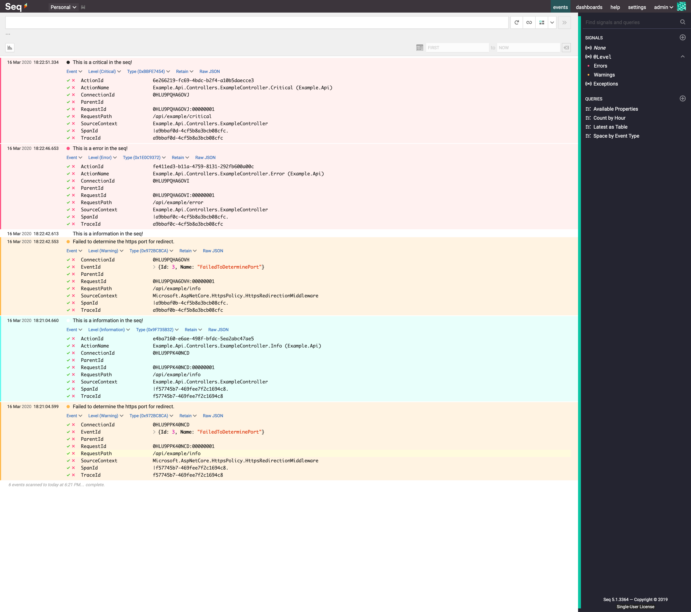

# 

This is a small project to experiment and test the [Seq](https://datalust.co/seq).



## Run

This example requires a `docker compose` to run as fast as possible.  
The following command will start the `Api` project together with image for `Seq`:  

```bash
docker-compose up --build
```

Then you can use browser/cli/whatever to run the commands against the exposed endpoints in the `Api` itself. An example:

```bash
curl http://localhost:5000/api/example/info
```

You can check the output in he UI of the `Seq` (`http://localhost:80`).
